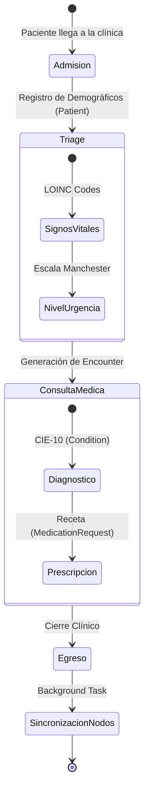
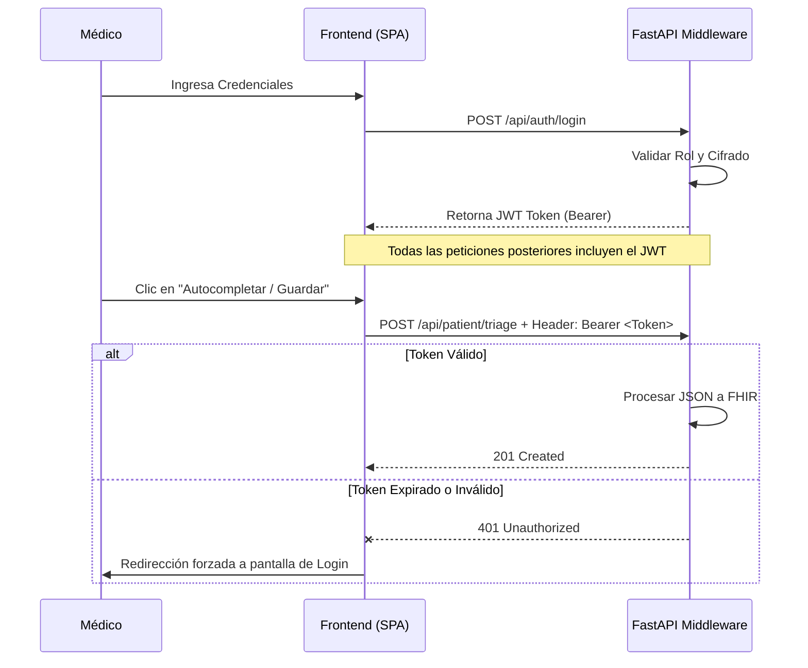

**EHR Hub** es una plataforma integral de **Historia Clínica Electrónica (EHR)** de grado empresarial. Diseñada bajo una arquitectura distribuida y tolerante a fallos, aborda el desafío de la fragmentación de datos clínicos a través de una red de múltiples regiones geográficas. El proyecto cumple estrictamente con los **57 campos de interoperabilidad de la normativa de salud** y adopta el estándar internacional **HL7 FHIR Release 4B**.

---

## 📑 Tabla de Contenidos
1. [Arquitectura del Sistema](#-arquitectura-del-sistema)
2. [Ciclo de Vida Clínico (Estado)](#-ciclo-de-vida-clínico)
3. [Diccionario de Datos: Los 57 Campos](#-diccionario-de-datos-los-57-campos)
4. [Mapeo de Modelos a Recursos FHIR](#-mapeo-de-modelos-a-recursos-fhir)
5. [Seguridad y Control de Acceso](#-seguridad-y-control-de-acceso)
6. [Estrategia de Fragmentación (Sharding)](#-estrategia-de-fragmentación-sharding-y-tolerancia-a-fallos)
7. [API Reference](#-api-reference)
8. [Estructura del Proyecto](#-estructura-del-proyecto)
9. [Guía de Despliegue Local](#-guía-completa-de-despliegue-local)

---

## 🏗️ Arquitectura del Sistema

El sistema utiliza un **Middleware en Python (FastAPI)** que actúa como API Gateway y director de orquesta entre la interfaz de usuario web y los servidores **HAPI FHIR**.

```text
┌─────────────────────────────────────────────────────────────┐
│                    FRONTEND (HTML/CSS/JS)                   │
│  ┌────────────────────────────────────────────────────┐     │
│  │  Módulos UI: Admisión | Triage | Atención | Reportes │   │
│  └────────────────────────────────────────────────────┘     │
└─────────────────────────────────────────────────────────────┘
                            ↓ HTTP/REST (JWT Auth)
┌─────────────────────────────────────────────────────────────┐
│              BACKEND API (FastAPI / Python)                 │
│  ┌────────────────────────────────────────────────────┐     │
│  │  Transformación y Mapeo Pydantic → Recursos FHIR   │     │
│  └────────────────────────────────────────────────────┘     │
└─────────────────────────────────────────────────────────────┘
                            ↓ FHIR REST API
┌─────────────────────────────────────────────────────────────┐
│           HAPI FHIR SERVER (Clúster Distribuido)            │
│  ┌────────────────────────────────────────────────────┐     │
│  │  Validación y Almacenamiento (HL7 FHIR R4B)        │     │
│  └────────────────────────────────────────────────────┘     │
└─────────────────────────────────────────────────────────────┘
                            ↓ JDBC
┌─────────────────────────────────────────────────────────────┐
│         BASE DE DATOS DISTRIBUIDA (PostgreSQL 15)           │
│  ┌──────────┐    ┌──────────┐    ┌──────────┐               │
│  │  Nodo 1  │    │  Nodo 2  │    │  Nodo 3  │               │
│  │ Sincelejo│    │ Bogotá   │    │ Medellín │               │
│  │ doc < 4B │    │ 4B - 7B  │    │ doc ≥ 7B │               │
│  └──────────┘    └──────────┘    └──────────┘               │
└─────────────────────────────────────────────────────────────┘
```

---

## 🔄 Ciclo de Vida Clínico

El flujo de atención de un paciente dentro del sistema sigue una máquina de estados estricta, asegurando la integridad referencial de los datos médicos.



---

## 📖 Diccionario de Datos: Los 57 Campos

El sistema captura y procesa de manera estructurada los 57 campos requeridos para un registro interoperable. 

| Grupo Clínico | Campos Incluidos | Recurso FHIR |
| :--- | :--- | :--- |
| **1. Identificación** | Tipo Doc, Número Doc, País, Nombre, Fecha Nac, Edad, Unidad Edad, Sexo, Género, Ocupación, Voluntad Anticipada, Categoría Discapacidad, País Residencia, Municipio, Etnia. | `Patient` |
| **2. Atención** | Entidad de salud, Fecha ingreso, Modalidad, Entorno, Vía ingreso, Causa, Fecha triage, Nivel triage, Comunidad. | `Encounter` |
| **3. Tecnologías** | Medicamento, Dosis, Vía adm., Frecuencia, Días tratamiento, Unidades, ID Personal, Finalidad, Diagnóstico ingreso (Tipo y Código), Tipo dx egreso. | `MedicationRequest` |
| **4. Diagnósticos** | Diagnóstico egreso (Principal), Diagnóstico Relacionado 1, Diagnóstico Relacionado 2, Diagnóstico Relacionado 3. (Codificación CIE-10). | `Condition` |
| **5. Egreso** | Fecha salida, Condición, Dx Muerte, Código Prestador, Incapacidad (Tipo/Días), Licencia, Alergias, Antecedentes, Riesgos, Responsable, Residencia (Zona/Dirección/Teléfono/Correo), Acompañante (Nombre/Parentesco/Teléfono). | `Encounter` / `Patient` |

---

## 🧬 Mapeo de Modelos a Recursos FHIR

El middleware procesa los 57 campos y los descompone en grafos de recursos FHIR interconectados:

* 👤 **`Patient`**: Demografía e identificadores únicos.
* 🏥 **`Encounter`**: Modela el evento de atención, agrupando Triage, motivo de consulta, y médicos tratantes.
* 🩺 **`Observation`**: Registra constantes vitales usando códigos **LOINC** (Frecuencia cardíaca, Presión, Temperatura, SpO2).
* 🦠 **`Condition`**: Modela los diagnósticos médicos mapeados usando el estándar **CIE-10**.
* 💊 **`MedicationRequest`**: Representa la prescripción médica generada al egreso.

---

## 🔐 Seguridad y Control de Acceso

El sistema simula el flujo de autorización de **SMART on FHIR** garantizando que solo el personal médico autenticado interactúe con el clúster.



---

## 🔀 Estrategia de Fragmentación (Sharding) y Tolerancia a Fallos

El sistema implementa un enrutamiento determinista para distribuir la carga de bases de datos basado en la cédula del paciente (`numeroDocumento`):

* 📍 **Nodo 1 (Sincelejo):** `ID < 4,000,000,000`
* 📍 **Nodo 2 (Bogotá):** `4,000,000,000 ≤ ID < 7,000,000,000`
* 📍 **Nodo 3 (Medellín):** `ID ≥ 7,000,000,000`

### Tolerancia a Fallos (Failover Automation)
Si el Nodo Primario cae, el Middleware redirige el tráfico dinámicamente al secundario más sano. Inmediatamente después, un proceso asíncrono (Worker) replica en *modo espejo* la data hacia los nodos restantes para asegurar consistencia eventual.

---

## 🔌 API Reference

El backend expone una interfaz REST documentada automáticamente mediante Swagger OpenAPI.

| Método | Endpoint | Payload / Header | Descripción |
| :--- | :--- | :--- | :--- |
| `POST` | `/api/auth/login` | `email`, `password` | Generación de token JWT (Simulación SMART). |
| `POST` | `/api/patient/admision` | `JWT`, JSON (15 campos) | Registro de Paciente en el clúster FHIR. |
| `POST` | `/api/patient/triage` | `JWT`, JSON (9 campos) | Generación de Signos Vitales (`Observation`). |
| `POST` | `/api/patient/consulta` | `JWT`, JSON (33 campos) | Diagnósticos (`Condition`) y Recetas. |
| `GET` | `/api/patient/{cedula}/clinical-record` | `JWT` | Obtiene Expediente Unificado de los nodos. |
| `DELETE`| `/api/admin/purge-all` | `JWT` | Purga asíncrona de BD de prueba. |

---

## 📁 Estructura del Proyecto

```bash
Proyecto-Historia-Clinica-Distribuida/
├── backend/
│   ├── fhir_app/
│   │   ├── models/            # Modelos Pydantic (Validación de entrada)
│   │   ├── routers/           # Controladores API REST (FastAPI)
│   │   ├── services/          # Conexión a HAPI FHIR y Sharding Logic
│   │   └── transformers/      # Conversores de JSON crudo a HL7 FHIR (R4B)
├── docker-compose.yml         # Orquestador del clúster (9 contenedores)
├── Dockerfile                 # Construcción de la imagen Middleware Python
├── prometheus/                # Configuración de observabilidad y targets
├── static/                    # Assets (CSS Glassmorphism, JS)
├── templates/                 # Frontend SPA (index.html)
└── README.md                  # Esta documentación
```

---

## 🚀 Guía Completa de Despliegue Local

Para desplegar la red de hospitales distribuidos, asegúrate de tener `Docker` y `Docker Compose` instalados.

### 1. Levantar el Clúster
```bash
# Clonar el proyecto
git clone <tu-repositorio>
cd Proyecto-Historia-Clinica-Distribuida

# Desplegar en modo demonio (Tomará tiempo descargar las imágenes de Java y Postgres)
docker compose up -d --build
```

### 2. Verificar el Estado del Sistema
Revisa que los 9 contenedores (Postgres x3, HAPI FHIR x3, Middleware, Prometheus, Grafana) operen correctamente:
```bash
docker compose ps
```

### 3. Puertos de Acceso

* 🏥 **Portal Clínico Web:** [http://localhost:8001](http://localhost:8001)
* ⚙️ **Middleware Swagger UI:** [http://localhost:8001/docs](http://localhost:8001/docs)
* 📊 **Observabilidad Global (Grafana):** [http://localhost:3000](http://localhost:3000) *(User/Pass: admin)*
* 📈 **Métricas Raw (Prometheus):** [http://localhost:9090](http://localhost:9090)
* 📡 **Servidores FHIR Raw (Nodos):** 
  * Sincelejo: `http://localhost:8081/fhir`
  * Bogotá: `http://localhost:8082/fhir`
  * Medellín: `http://localhost:8083/fhir`

### 4. Apagar el Clúster
```bash
docker compose down -v
```
*(El flag `-v` limpia los volúmenes de base de datos para restaurar a estado de fábrica).*

---
*Desarrollado como proyecto de arquitectura e ingeniería de software corporativa para sistemas de salud escalables e interoperables.*
